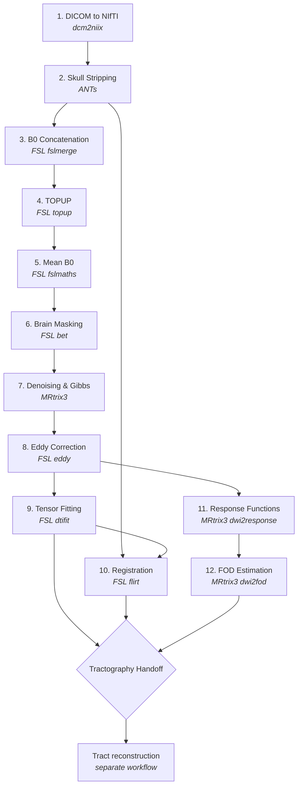

# Pipeline Overview

## Introduction

This pipeline follows the standardized preprocessing flow used across major diffusion MRI projects including the Human Connectome Project (HCP), UK Biobank, and the Adolescent Brain Cognitive Development (ABCD) study. The core stages -- brain extraction, denoising, motion correction, distortion correction, and tensor fitting -- represent the accepted minimum set of operations required to produce reliable diffusion tensor maps from raw scanner data.

**Reference:** Maximov, I.I., Alnaes, D., & Westlye, L.T. (2019). Towards an optimised processing pipeline for diffusion magnetic resonance imaging data: Effects of artefact corrections on diffusion metrics and their age associations in UK Biobank. *Human Brain Mapping*, 40(14), 4146-4162. See also: https://doi.org/10.1016/j.neuroimage.2021.118756

---

## Pipeline Stages

The required path is **twelve steps in two parts**. Part A is the correction work every diffusion study needs. Part B produces the specific files a tractography workflow reads. A few further steps are useful but optional, and are listed separately.

Your workflow may include fewer or more steps depending on your acquisition, analysis goals, and software choices — this is one well-tested configuration, not the only way to preprocess diffusion data.

### Part A — Core Preprocessing

| Step | Name | Purpose | Tool(s) |
|---|---|---|---|
| 1 | [DICOM to NIfTI](./dicom-to-nifti) | Standardize raw scanner data | dcm2niix |
| 2 | [Skull Stripping](./skull-stripping) | Remove non-brain tissue | ANTs |
| 3 | [B0 Concatenation](./b0-concatenation) | Merge AP/PA fieldmaps | FSL |
| 4 | [TOPUP](./topup) | Correct susceptibility distortions | FSL |
| 5 | [Mean B0](./mean-b0) | Create high-SNR reference image | FSL |
| 6 | [Brain Masking](./brain-masking) | Define analysis region | FSL |
| 7 | [Denoising & Gibbs](./denoising-gibbs) | Remove noise and ringing artifacts | MRtrix3 |
| 8 | [Eddy Correction](./eddy) | Correct motion and eddy currents | FSL |

### Part B — Tractography Readiness

| Step | Name | Purpose | Tool(s) |
|---|---|---|---|
| 9 | [Tensor Fitting](./dtifit) | Compute FA, MD, RD, AD | FSL |
| 10 | [Registration](./flirt-registration) | Align T1 to diffusion space | FSL |
| 11 | [Response Functions](./response-functions) | Estimate per-tissue reference signals | MRtrix3 |
| 12 | [FOD Estimation](./fod-estimation) | Deconvolve to fiber orientation distributions | MRtrix3 |
| — | [Tractography Handoff](./output-contract) | Verify outputs before tracking | — |

### Optional Steps

These are covered in this tutorial but are not required to reach tractography.

| Name | Purpose | When you need it |
|---|---|---|
| [BedpostX](./bedpostx) | Bayesian fiber orientation estimation | The FSL `probtrackx2` tractography route |
| [Shell Extraction](./shell-extraction) | Isolate b-value shells | Tensor fitting — **not** for MSMT-CSD, which needs all shells |
| [ICV Calculation](./icv-calculation) | Estimate intracranial volume | As a statistical covariate |
| [BIDS & pyAFQ](./pyafq-bids) | Organize for pyAFQ | pyAFQ's automated whole-brain bundle recognition |

---

## Pipeline Flowchart



:::note
Steps 9 and 11 both branch from Step 8 — tensor fitting and FOD estimation are independent of each other and can run in parallel. Registration (Step 10) needs the skull-stripped T1 from Step 2 as well. All three converge at the [handoff](./output-contract).
:::

---

## Why This Specific Pipeline?

### Core Operations (Required)

The following stages are accepted across the field as minimum required operations for diffusion MRI preprocessing:

- **Brain extraction** (Step 2) -- non-brain tissue introduces artifacts and errors in all downstream steps
- **Susceptibility distortion correction** (Step 4) -- corrects geometric distortions caused by magnetic field inhomogeneities
- **Denoising** (Step 7) -- thermal noise degrades tensor estimation, especially at higher b-values
- **Motion and eddy current correction** (Step 8) -- subject motion and eddy currents cause volume misalignment and signal distortions
- **Tensor fitting** (Step 9) -- the fundamental computation that produces FA, MD, and other diffusion metrics

### Software-Specific Steps

Some stages exist because of specific software requirements rather than conceptual necessity:

- **B0 concatenation** (Step 3) -- FSL's `topup` requires AP and PA B0 volumes in a single file
- **Mean B0 creation** (Step 5) -- averaging multiple B0 volumes produces a higher-SNR reference for brain masking
- **Brain masking** (Step 6) -- `eddy` requires an explicit brain mask; this refines the initial skull strip

### Processing Standards

This sequence reflects the processing standards established by:

- **Human Connectome Project (HCP)** -- the gold standard for diffusion MRI processing
- **UK Biobank** -- large-scale population imaging with automated preprocessing
- **ABCD Study** -- multi-site developmental neuroimaging with rigorous QC

---

## Automated Alternative: QSIPrep

[QSIPrep](../tools/qsiprep.md) is a containerized tool that automates many of the same preprocessing steps described in this tutorial. It runs inside Docker or Singularity and handles the full workflow automatically. See the [QSIPrep page](../tools/qsiprep.md) for more information.

---

## Directory Structure Convention

Organizing outputs into a consistent directory structure makes the pipeline manageable across subjects. The recommended layout:

```
project/
  raw/                    # Raw DICOMs
  NIFTI/                  # Converted NIfTI files
  derivatives/
    ANTs/                 # Skull stripping outputs
    TOPUP/                # Distortion correction
    EDDY/                 # Motion/eddy correction
    DTIFIT/               # Tensor fitting outputs
    FLIRT/                # Registration matrices
    ICV/                  # Intracranial volume
    pyAFQ/                # BIDS-formatted for tractography
  config/                 # Configuration files (acqp.txt, index.txt)
```

Each subject's outputs live within the appropriate derivatives subdirectory. For example:

```
derivatives/
  DTIFIT/
    sub-001/
      sub-001_dtifit_FA.nii.gz
      sub-001_dtifit_MD.nii.gz
      sub-001_dtifit_RD.nii.gz
      sub-001_dtifit_AD.nii.gz
    sub-002/
      ...
```

This structure keeps raw data separate from processed outputs and groups outputs by processing stage, making it straightforward to locate files and run batch operations.

---

## Reference Implementation

The full pipeline described in this tutorial has been implemented and run end to end on a real multi-shell dataset:

**Repository:** [github.com/DiffusionTensorImaging-Repos/SDN-IMPACT-DTI](https://github.com/DiffusionTensorImaging-Repos/SDN-IMPACT-DTI)

It includes batch processing scripts, configuration files, and the QC output from each step. Use it as a reference when adapting the pipeline to your own data — see the [Worked Example](../reference/worked-example) page for what it contains.

---

## Getting Practice Data

Before diving into the pipeline stages, you will need diffusion MRI data to work with. The [Practice Data](../reference/practice-data) page provides instructions for obtaining sample datasets suitable for working through this tutorial.
